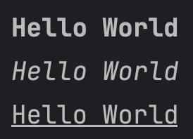
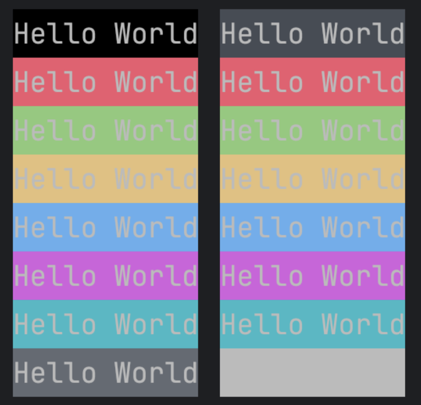
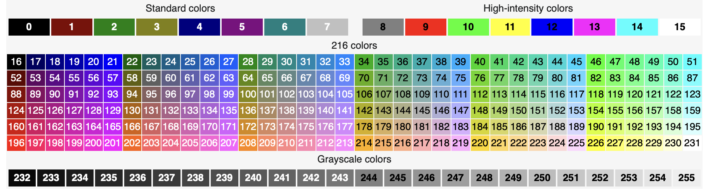
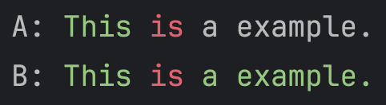

# Bold, Italic and Underline
```kotlin
fun main() {
    println("Hello World".rich { it.bold() })
    println("Hello World".rich { it.italic() })
    println("Hello World".rich { it.underline() })
}
```


# Foreground color

**Colors may be different at different platforms.**

[You can check at here.](https://en.wikipedia.org/wiki/ANSI_escape_code#3-bit_and_4-bit)

```kotlin
fun main() {
    println("Hello World".rich { it.fgColor(AnsiColor.BLACK) })
    println("Hello World".rich { it.fgColor(AnsiColor.RED) })
    println("Hello World".rich { it.fgColor(AnsiColor.GREEN) })
    println("Hello World".rich { it.fgColor(AnsiColor.YELLOW) })
    println("Hello World".rich { it.fgColor(AnsiColor.BLUE) })
    println("Hello World".rich { it.fgColor(AnsiColor.MAGENTA) })
    println("Hello World".rich { it.fgColor(AnsiColor.CYAN) })
    println("Hello World".rich { it.fgColor(AnsiColor.WHITE) })
}
fun main() {
    println("Hello World".rich { it.fgColor(AnsiColor.BRIGHT_BLACK) })
    println("Hello World".rich { it.fgColor(AnsiColor.BRIGHT_RED) })
    println("Hello World".rich { it.fgColor(AnsiColor.BRIGHT_GREEN) })
    println("Hello World".rich { it.fgColor(AnsiColor.BRIGHT_YELLOW) })
    println("Hello World".rich { it.fgColor(AnsiColor.BRIGHT_BLUE) })
    println("Hello World".rich { it.fgColor(AnsiColor.BRIGHT_MAGENTA) })
    println("Hello World".rich { it.fgColor(AnsiColor.BRIGHT_CYAN) })
    println("Hello World".rich { it.fgColor(AnsiColor.BRIGHT_WHITE) })
}

```

# Background color
```kotlin
fun main() {
    println("Hello World".rich { it.bgColor(AnsiColor.BLACK) })
    println("Hello World".rich { it.bgColor(AnsiColor.RED) })
    println("Hello World".rich { it.bgColor(AnsiColor.GREEN) })
    println("Hello World".rich { it.bgColor(AnsiColor.YELLOW) })
    println("Hello World".rich { it.bgColor(AnsiColor.BLUE) })
    println("Hello World".rich { it.bgColor(AnsiColor.MAGENTA) })
    println("Hello World".rich { it.bgColor(AnsiColor.CYAN) })
    println("Hello World".rich { it.bgColor(AnsiColor.WHITE) })
}
fun main() {
    println("Hello World".rich { it.bgColor(AnsiColor.BRIGHT_BLACK) })
    println("Hello World".rich { it.bgColor(AnsiColor.BRIGHT_RED) })
    println("Hello World".rich { it.bgColor(AnsiColor.BRIGHT_GREEN) })
    println("Hello World".rich { it.bgColor(AnsiColor.BRIGHT_YELLOW) })
    println("Hello World".rich { it.bgColor(AnsiColor.BRIGHT_BLUE) })
    println("Hello World".rich { it.bgColor(AnsiColor.BRIGHT_MAGENTA) })
    println("Hello World".rich { it.bgColor(AnsiColor.BRIGHT_CYAN) })
    println("Hello World".rich { it.bgColor(AnsiColor.BRIGHT_WHITE) })
}
```


# All 256 colors



# Also support RGB

```kotlin
fun fg/bgColor(r: Int, g: Int, b: Int)
// r for red, range from 0 to 255
// g for green, range from 0 to 255
// b for blue, range from 0 to 255
```

# !!! Problem
***This DSL has a tricky problem***

When you write something like this:

```kotlin
fun main() {
    val inner = "is".rich { it.fgColor(AnsiColor.RED) }
    val outer = "This $inner a example.".rich { it.fgColor(AnsiColor.GREEN) }
    println(outer)
}
```

Which one is the result?



We prefer B, right? But the result is A. 

This happens because once the `rich{}` function has finished, it will reset the text to default status.

When `println` has been invoked:

Status changes from *DEFAULT* -> *GREEN* (We write "This" here) -> *DEFAULT* -> *RED* ("is" is here) -> *DEFAULT* (The last part, "a example.", is in the default color because "is" is accomplished by `rich{}`, which resets the status to default.)

This is the downside of this DSL, and I have no idea to solve this in an elegant way.

The only thing I can do is warn you not to use this DSL in a nested way.