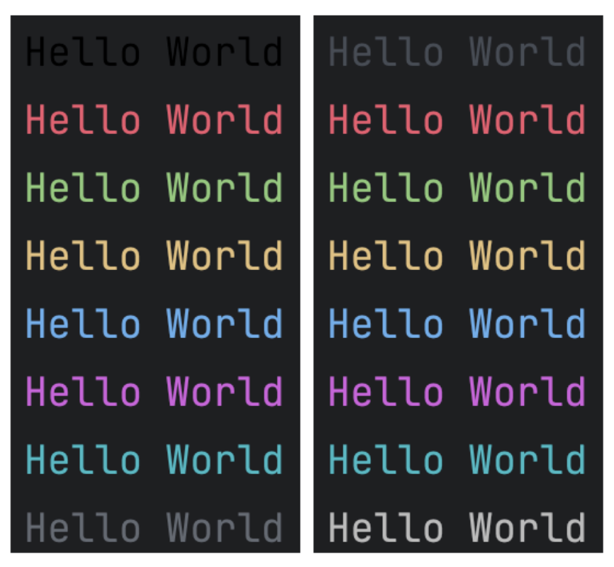

# Bold, Italic and Underline
```kotlin
fun main() {
    println("Hello World".rich { it.bold() })
    println("Hello World".rich { it.italic() })
    println("Hello World".rich { it.underline() })
}
```


# Foreground color
```kotlin
fun main() {
    println("Hello World".rich { it.fgColor(AnsiColor.BLACK) })
    println("Hello World".rich { it.fgColor(AnsiColor.RED) })
    println("Hello World".rich { it.fgColor(AnsiColor.GREEN) })
    println("Hello World".rich { it.fgColor(AnsiColor.YELLOW) })
    println("Hello World".rich { it.fgColor(AnsiColor.BLUE) })
    println("Hello World".rich { it.fgColor(AnsiColor.MAGENTA) })
    println("Hello World".rich { it.fgColor(AnsiColor.CYAN) })
    println("Hello World".rich { it.fgColor(AnsiColor.WHITE) })
}
fun main() {
    println("Hello World".rich { it.fgColor(AnsiColor.BRIGHT_BLACK) })
    println("Hello World".rich { it.fgColor(AnsiColor.BRIGHT_RED) })
    println("Hello World".rich { it.fgColor(AnsiColor.BRIGHT_GREEN) })
    println("Hello World".rich { it.fgColor(AnsiColor.BRIGHT_YELLOW) })
    println("Hello World".rich { it.fgColor(AnsiColor.BRIGHT_BLUE) })
    println("Hello World".rich { it.fgColor(AnsiColor.BRIGHT_MAGENTA) })
    println("Hello World".rich { it.fgColor(AnsiColor.BRIGHT_CYAN) })
    println("Hello World".rich { it.fgColor(AnsiColor.BRIGHT_WHITE) })
}

```

# Background color
```kotlin
fun main() {
    println("Hello World".rich { it.bgColor(AnsiColor.BLACK) })
    println("Hello World".rich { it.bgColor(AnsiColor.RED) })
    println("Hello World".rich { it.bgColor(AnsiColor.GREEN) })
    println("Hello World".rich { it.bgColor(AnsiColor.YELLOW) })
    println("Hello World".rich { it.bgColor(AnsiColor.BLUE) })
    println("Hello World".rich { it.bgColor(AnsiColor.MAGENTA) })
    println("Hello World".rich { it.bgColor(AnsiColor.CYAN) })
    println("Hello World".rich { it.bgColor(AnsiColor.WHITE) })
}
fun main() {
    println("Hello World".rich { it.bgColor(AnsiColor.BRIGHT_BLACK) })
    println("Hello World".rich { it.bgColor(AnsiColor.BRIGHT_RED) })
    println("Hello World".rich { it.bgColor(AnsiColor.BRIGHT_GREEN) })
    println("Hello World".rich { it.bgColor(AnsiColor.BRIGHT_YELLOW) })
    println("Hello World".rich { it.bgColor(AnsiColor.BRIGHT_BLUE) })
    println("Hello World".rich { it.bgColor(AnsiColor.BRIGHT_MAGENTA) })
    println("Hello World".rich { it.bgColor(AnsiColor.BRIGHT_CYAN) })
    println("Hello World".rich { it.bgColor(AnsiColor.BRIGHT_WHITE) })
}
```


# All 256 colors


# Also support RGB

```kotlin
fun fg/bgColor(r: Int, g: Int, b: Int)
// r for red, range from 0 to 255
// g for green, range from 0 to 255
// b for blue, range from 0 to 255
```